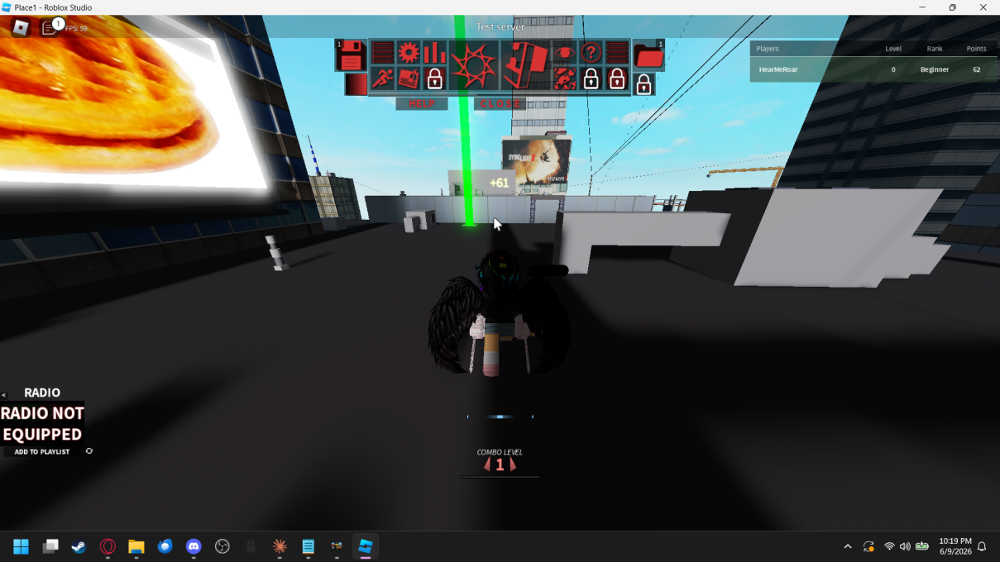

# 🖥️ LAN Roblox Studio (2023)

> **⚠️ This is a developer tool, NOT a revival project.**
> LAN Roblox Studio is a local server environment for running and testing 2023-era Roblox games entirely offline on your LAN. No Roblox accounts are impersonated (Everything is local except for asset grabbing which you use your OWN cookie for.), no live services are targeted, and no online infrastructure is replicated with the intent of replacing Roblox. This project exists purely as a personal dev/testing utility.

---

## What Is This?

LAN Roblox Studio spins up a self-contained local server that mimics the Roblox backend APIs needed to actually *run* games — things like DataStore, player data persistence, and session handling. Games are stored locally in **gzip-compressed** `.rbxl` files to keep disk usage minimal. The Studio front-end connects to the local server instead of Roblox's live endpoints, letting you launch and play games on your home network without an internet connection.

Think of it as a private sandbox for tinkering with classic 2023-era games: tweak scripts, test DataStore behavior, run multiplayer sessions over LAN, or just play around without touching any live services.

---

## Features

- **Local API services** — DataStore read/write, player session management, and more, all served from your machine
- **Gzip-compressed game storage** — `.rbxl.gz` files keep your game library small; games are decompressed on demand at launch
- **LAN multiplayer** — other machines can join sessions just like a normal Roblox server
- **2023 client compatibility** — targets the 2023 Roblox Studio/client build; scripts and game logic behave as they did at that time
- **Offline-first** — no internet required after initial setup

---

## Screenshots

### Game Browser
The Studio game browser lists all locally saved games. Thumbnails, game names, and visibility status are all stored alongside the compressed place files.


Games visible in the library include Theme Park Tycoon 2, Doomspire Brickbattle, Prison Life V2.0, Natural Disaster Survival, Flood Escape 1.6.5, Robot 64, The Streets, Jailbreak, The Normal Elevator, Twisted Murderer, MM2, Assassin, Booga Booga, Lumber Tycoon 2, Epic Minigames, Mad Games, and many more.

---

### Flood Escape — DataStore in Action
Player stats (level, money) are persisted through the local DataStore API. Here the leaderboard correctly loads and saves `owo`'s level and money across sessions.


---

### Theme Park Tycoon 2 — LAN Multiplayer
Multiple players connected over LAN. Visitor counts and money figures are tracked through the local session and DataStore services — no live Roblox backend involved.


---

### MM2 (Murder Mystery 2) — Full Game Loop
Map voting, round state, inventory, shop, and the Battlepass UI all function correctly. The local server handles round lifecycle and DataStore calls that MM2's scripts expect.


---

### The Streets — Test Server
Running The Streets through the Studio test-server mode. The player scoreboard (level, rank, points) populates from the local DataStore. The "Test server" header confirms this is a local session, not a live one.



---

## How Games Are Stored

Games are saved as gzip-compressed Roblox place files:
(THESE CAN ONLY BE OPENED VIA MY GAMES!!! OPENING THEM DIRECTLY WILL FAIL WITH A FORMAT ISSUE DUE TO THEM BEING GZIPPED.)
```
data/
├── SavedData/
├──── 9000000000001.rbxl
├──── 9000000000003.rbxl
├──── 9000000000005.rbxl
├──── 9000000000013.rbxl
└── ...
```

On launch the server decompresses the requested place into a temp directory, starts the local Roblox server process pointing at that place file, and tears it down when the session ends. Original compressed files are never modified.

---

## API Services

The local backend currently implements:

| Service | Status |
|---|---|
| DataStoreService (Get/Set/Update/Remove) | ✅ Working |
| OrderedDataStore | ✅ Working |
| Player session / join data | ✅ Working |

> **Note:** A Roblox account cookie is required and used solely to download assets (meshes, textures, audio, etc.) from `roblox.com` at run time. It is never used to interact with live roblox.com game servers, player data, or any other live Roblox service. Asset grabbing currently does not have a save feature but that is planned in a later release.

---

## Disclaimer

This tool is for **personal, offline development and testing/game-testing only**. A Roblox account cookie is used to download game assets from Roblox's CDN — this is the extent of its interaction with Roblox's infrastructure. It does not connect to, scrape, or interfere with Roblox's live game services or player data. All games stored locally were obtained by the repository owner for personal use. This project is not affiliated with, endorsed by, or connected to Roblox Corporation in any way.

**This is not a revival. Do not use it as one.**
